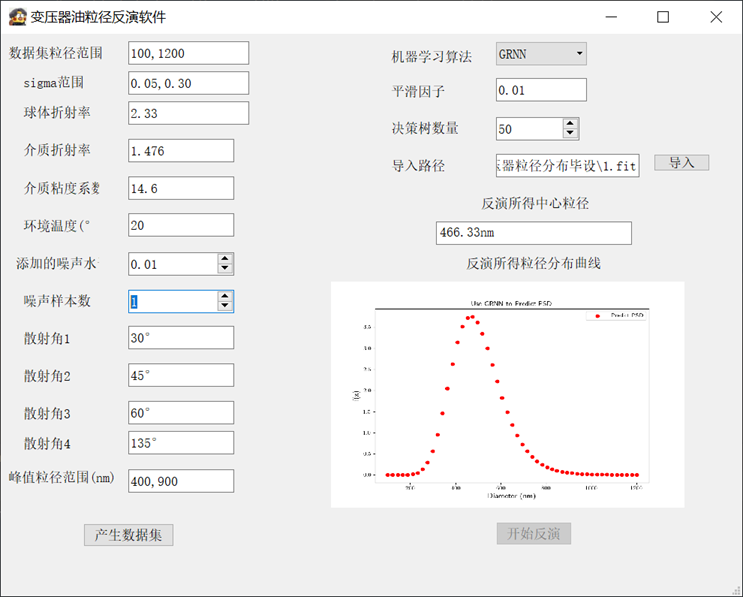

<div align="center">

<h1>MDLS-model-building</h1>
基于MDLS的粒径分布反演项目<br><br>

</div>

------

## 简介
本仓库是毕业设计内容，具有以下特点:
+ 结合了多角度动态光散射技术；
+ 即便在相对较差的显卡甚至是cpu上也能快速训练和推理;
+ 可自主调参创建数据集，并决定含噪样本水平;
+ 内置了多种机器学习算法，包括重构的GRNN网络，速度可与matlab媲美;
+ 简单易用的UI界面;
+ 创建数据集时设置进度条，更加直观人性化。
+ GRNN和[MDLS](https://pypi.org/project/fischer)的api已上传到pypi上。
## 环境配置


以下指令需在Python版本大于3.6的环境当中执行:
```bash
# 安装Pytorch（可不安装）及其核心依赖，若已安装则跳过
# 参考自: https://pytorch.org/get-started/locally/
pip install torch numpy scikit-learn scipy PyMieScatt matplotlib

```
你也可以通过pip来安装依赖：

```bash
pip install -r requirements.txt
```

## 模型下载

你可以从[百度网盘]()下载到这些模型。

以下是一份清单，包括了所有模型和数据集的名称:
```bash
#TODO
```
之后使用以下指令来调用ui:
```bash
python main.py
```



